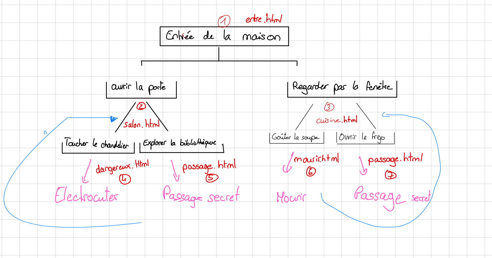

 Seminaire 02 - Outils

[Chloe Rapin]

## Temps passe

| Tache        | Temps estime | Temps passe | Commentaire     |
| ------------ | -----------  | ------------| -----------------|
|     Aventure |    10 min    | 50min       |  une fois qu'on a compris ça va plus vite  |
|votre aventure |      1h     | 1h30        | même chose qu'avant assez ludique à faire|
|    rapport   |       5min    | 20 min     | remplirle rapport
|              |               | 
|              |               | 
|              |               | 
| Total           |            |    2h40   |

difficulté : trouver une idée de jeux avec le découlement des différents choix. Une fois que c'est fait le reste reste assez similaire à l'exercie d'avant donc ça va